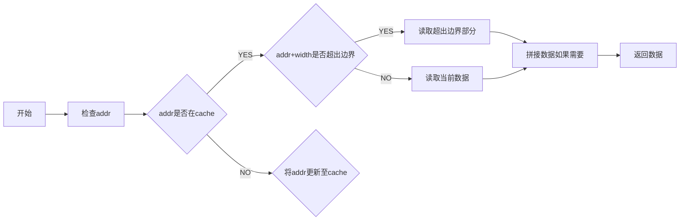
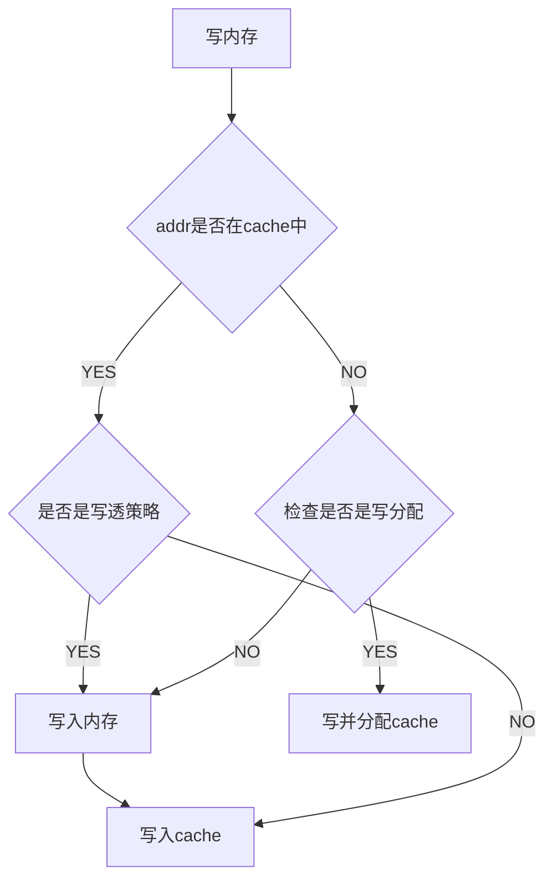

# SimCache #

## 基本假设 ##
假设所有给出的地址符合4字节地址对齐的要求，因此每个cache block最小为4字节，大小必须为4字节的倍数。而给出的组相连associativity，set数量都是2,4,8,16等规则的数据

## 代码结构 ##
cache.c:模拟相关的cache操作，包括初始化，释放，替换，
memory.c：模拟内存相关操作，包括读内存和写内存

## 设计逻辑 ##
- 在运行开始需要调用cache初始化函数，提供相关数据的设置，配置cache的相关信息存储在cache_config中
#### 内存操作 ####
- 读内存：调用`memory_read(ADDR64 addr , int width)`函数，代表从addr地址读取宽度为8,16,32,64的数据。流程为：

- 写内存：调用`memory_write(addr,width,data)`函数将宽度为width（8,16,32,64）的数据data写入addr位置。流程如下：

